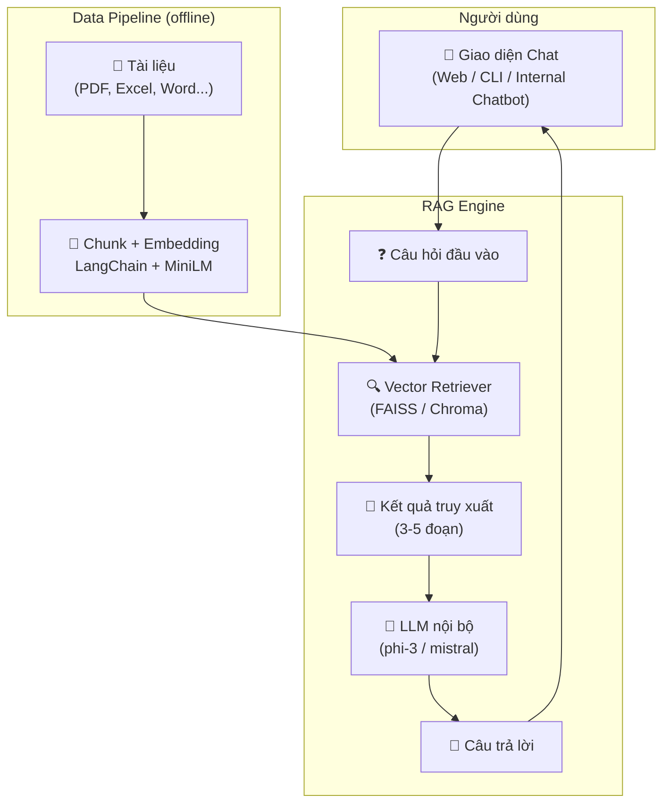

# 🧠 RAG-based AI Copilot for Internal Knowledge – On-Prem Deployment (No GPU)

## ✅ 1. Mục tiêu hệ thống
Xây dựng một hệ thống trợ lý AI nội bộ có khả năng:
- Trả lời câu hỏi tự nhiên dựa trên tài liệu công ty (PDF, Word, Excel, SharePoint…)
- Không sử dụng cloud LLM – đảm bảo dữ liệu **không rò rỉ**
- Có thể mở rộng lên nhiều người dùng

---

## 🏗️ 2. Kiến trúc tổng thể

---

## ⚙️ 3. Thành phần chính

| Thành phần | Công nghệ gợi ý | Vai trò |
|------------|------------------|---------|
| LLM nội bộ | [`Ollama`](https://ollama.com) + `phi-3`, `mistral` | Sinh câu trả lời, chạy bằng CPU |
| Embedding | `Instructor`, `all-MiniLM-L6-v2`, `BGE` | Biến đoạn văn thành vector |
| Vector DB | `Chroma`, `FAISS` | Lưu trữ vector tìm kiếm |
| Document Loader | LangChain: `PyPDFLoader`, `DocxLoader`, `PandasLoader` | Đọc & xử lý tài liệu đầu vào |
| Giao diện người dùng | `Streamlit`, `Gradio`, hoặc Web Chat | Chat với RAG agent |
| Orchestration | `LangChain RetrievalQA` / `ConversationalRetrievalChain` | Xử lý pipeline truy vấn |

---

### 📝 Mô tả chi tiết các thành phần chính

#### 1. Ollama (Local LLM Runner)
- **Chức năng:** Nền tảng chạy các mô hình ngôn ngữ lớn (LLM) trên máy chủ nội bộ, hỗ trợ nhiều model (phi-3, mistral, llama...).
- **Kiến trúc:** Đóng vai trò như backend LLM, cung cấp API phục vụ truy vấn sinh ngôn ngữ tự nhiên.
- **Lý do chọn:** Dễ triển khai, hỗ trợ CPU, không cần GPU, mã nguồn mở, bảo mật dữ liệu nội bộ.
- **So sánh:** So với LM Studio, llama.cpp: Ollama dễ dùng hơn, hỗ trợ nhiều model, có REST API chuẩn.

#### 2. phi-3, mistral (Mô hình LLM)
- **Chức năng:** Sinh câu trả lời tự động từ dữ liệu đã truy xuất.
- **Kiến trúc:** Được tải và phục vụ qua Ollama, tối ưu cho inference trên CPU.
- **Lý do chọn:** Nhẹ, tốc độ tốt, chất lượng trả lời cao, mã nguồn mở.
- **So sánh:** So với Llama 2, GPT-J: phi-3/mistral nhẹ hơn, dễ deploy on-prem, không cần GPU.

#### 3. Chroma, FAISS (Vector Database)
- **Chức năng:** Lưu trữ và tìm kiếm vector embedding của tài liệu.
- **Kiến trúc:** Chạy local, tích hợp tốt với LangChain, hỗ trợ tìm kiếm semantic.
- **Lý do chọn:** Cài đặt đơn giản, hiệu năng cao, mã nguồn mở, không cần dịch vụ cloud.
- **So sánh:** So với Pinecone, Weaviate: Chroma/FAISS không cần cloud, miễn phí, dễ tích hợp Python.

#### 4. Instructor, MiniLM, BGE (Embedding Model)
- **Chức năng:** Biến đoạn văn bản thành vector số để tìm kiếm semantic.
- **Kiến trúc:** Chạy local, tích hợp với pipeline embedding của LangChain.
- **Lý do chọn:** Nhẹ, tốc độ nhanh, chất lượng embedding tốt, mã nguồn mở.
- **So sánh:** So với OpenAI Embedding: Không cần cloud/API key, bảo mật dữ liệu.

#### 5. LangChain (Orchestration)
- **Chức năng:** Điều phối pipeline RAG: load tài liệu, chunk, embedding, truy vấn, tổng hợp kết quả.
- **Kiến trúc:** Framework Python, hỗ trợ nhiều thành phần plug-and-play.
- **Lý do chọn:** Cộng đồng lớn, tài liệu tốt, dễ mở rộng, tích hợp nhiều backend.
- **So sánh:** So với LlamaIndex: LangChain phổ biến hơn, nhiều ví dụ thực tế hơn.

#### 6. Gradio, Streamlit (Giao diện người dùng)
- **Chức năng:** Tạo giao diện chat web nhanh chóng cho người dùng nội bộ.
- **Kiến trúc:** Chạy local, dễ deploy, hỗ trợ nhiều tính năng UI.
- **Lý do chọn:** Dễ dùng, mã nguồn mở, không cần backend phức tạp.
- **So sánh:** So với FastAPI, Flask: Gradio/Streamlit dựng UI nhanh, không cần code HTML/JS.

---

## 🔐 4. Bảo mật & dữ liệu

- **Không dùng API OpenAI** → Không rò rỉ dữ liệu
- LLM, embedding, vector store **chạy toàn bộ on-prem**
- Không gửi bất kỳ nội dung nào ra internet
- Có thể phân quyền truy cập theo người dùng nếu tích hợp với hệ thống nội bộ

---

## 🧪 5. Yêu cầu hệ thống

| Thành phần | Mức tối thiểu |
|------------|---------------|
| RAM | 16 GB (khuyến nghị 32 GB) |
| CPU | i5 Gen8 / Ryzen 5 trở lên |
| Disk | SSD ≥ 30 GB |
| OS | Windows / macOS / Ubuntu |
| GPU | ❌ Không cần |

---

## 🚀 6. Cách triển khai (chi tiết)

### 🟢 Giai đoạn 1: Proof of Concept (Tuần 1)
- [ ] Cài đặt Ollama + LangChain + FAISS/Chroma
- [ ] Chọn 10 tài liệu nội bộ (PDF, Excel…)
- [ ] Tạo script embedding & chunk tài liệu
- [ ] Xây giao diện chat (Gradio / CLI)
- [ ] Demo nội bộ, kiểm tra độ chính xác

### 🟡 Giai đoạn 2: Rollout nội bộ (Tuần 2–3)
- [ ] Đồng bộ tài liệu từ thư mục dùng chung / SharePoint
- [ ] Tự động cập nhật vector store
- [ ] Triển khai lên server nội bộ (hoặc VPS riêng)
- [ ] Giao diện thân thiện (chat history, user context)

### 🔵 Giai đoạn 3: Mở rộng & tích hợp (Tuần 4+)
- [ ] Gắn với chatbot nội bộ (MS Teams, Zalo, Slack…)
- [ ] Phân quyền người dùng (nếu có SSO)
- [ ] Export báo cáo tương tác
- [ ] Theo dõi log truy vấn & độ chính xác

---

## 📦 7. Tài liệu đầu vào hỗ trợ

| Định dạng | Được hỗ trợ? | Ghi chú |
|----------|---------------|--------|
| PDF | ✅ | Tách theo trang hoặc đoạn |
| DOCX | ✅ | Dùng `DocxLoader` |
| Excel | ✅ | Dùng `PandasLoader` hoặc chuyển CSV |
| SharePoint | ✅ | Sync qua API hoặc mount thư mục |
| Google Drive | ⚠️ | Cần API OAuth2 |
| Database | ✅ | Truy vấn SQL → chunk nội dung |

---

##  8. Ước tính chi phí (nội bộ – không cloud)

| Mục | Chi phí |
|-----|---------|
| Phần mềm | ✅ 100% mã nguồn mở |
| Server nội bộ / VPS | 30–100 USD/tháng (tùy RAM & ổ đĩa) |
| Nhân sự setup | 1 kỹ sư (internal hoặc freelance) |
| Lưu trữ dữ liệu | Dựa theo kích thước PDF/Excel – không đáng kể |
| Tăng trưởng | Scale bằng thêm RAM/disk, không cần GPU |

---

## 📝 9. Mở rộng trong tương lai

- ✅ Gắn agent với hệ thống báo cáo Power BI / dashboard nội bộ
- ✅ Cho phép tải thêm tài liệu qua giao diện
- ✅ Lưu lịch sử truy vấn
- ✅ Đánh giá mức độ chính xác trả lời (feedback)
- ✅ Gắn chatbot vào ứng dụng CRM, ERP, HRM

---

## 📌 10. Tài liệu tham khảo

- [LangChain Docs](https://docs.langchain.com/)
- [Ollama – Local LLM Runner](https://ollama.com)
- [Instructor Embedding](https://huggingface.co/hkunlp/instructor-xl)
- [Chroma Vector DB](https://www.trychroma.com/)

---

## 📩 Gợi ý tiếp theo

- Bắt đầu thử với 10–20 file PDF từ phòng kế toán, pháp chế hoặc vận hành
- Dùng `ollama run mistral` + `langchain` để RAG mẫu
- Nếu cần, yêu cầu bộ **repo mẫu chạy ngay** từ mình

---

## 📑 Phụ lục: So sánh Chroma và Supabase (pgvector) cho Vector Database

| Tiêu chí                | Chroma                                 | Supabase (pgvector)                      |
|-------------------------|----------------------------------------|------------------------------------------|
| Bản chất                | Vector DB thuần túy, mã nguồn mở       | Backend đa năng, dựa trên PostgreSQL     |
| Triển khai              | Local/on-prem, pip install             | Cloud hoặc self-hosted, cấu hình phức tạp |
| Tích hợp                | Python API, LangChain                  | REST API, GraphQL, SDK đa nền tảng       |
| Tính năng               | Tìm kiếm semantic, metadata            | Vector search + DB, auth, storage, ...   |
| Bảo mật                 | Dữ liệu nội bộ, không cloud            | Phân quyền user, audit log, cloud option |
| Quản lý user/role       | Không                                  | Có                                       |
| Hiệu năng vector search | Cao, tối ưu cho RAG nhỏ gọn            | Phụ thuộc cấu hình PostgreSQL            |
| Chi phí                 | Miễn phí, không cloud                  | Có thể phát sinh phí cloud               |
| Độ phức tạp sử dụng     | Đơn giản, nhanh gọn                    | Đa năng, cấu hình phức tạp hơn           |

**Tóm tắt lựa chọn:**
- **Chroma:** Phù hợp cho RAG nội bộ, bảo mật, đơn giản, thuần Python.
- **Supabase (pgvector):** Phù hợp nếu cần backend tổng thể (DB, auth, storage), REST API, hoặc đã dùng PostgreSQL.

---

## ⚡ Hiệu năng hệ thống (Performance)

### 1. Hiệu năng LLM (Ollama + phi-3/mistral)
- **Trên CPU (không GPU):**
  - phi-3/mistral 7B: tốc độ sinh **5–15 token/giây** trên CPU phổ thông (i5 Gen8/Ryzen 5, 16–32GB RAM).
  - Máy chủ mạnh hơn (nhiều core, RAM lớn): **15–25 token/giây**.
- **So sánh:** GPU có thể đạt 30–60 token/giây, nhưng thiết kế này tối ưu cho CPU.

### 2. Hiệu năng Vector Search (Chroma/FAISS)
- Tìm kiếm semantic trên 1,000–10,000 chunk: **<1 giây** (local, RAM).
- Số chunk lớn (hàng trăm nghìn): 1–2 giây.
- Tốc độ embedding (MiniLM): ~1,000–2,000 đoạn/phút trên CPU.

### 3. Tổng thể pipeline RAG
- Một truy vấn hoàn chỉnh (retrieval + LLM):
  - Retrieval: **<1 giây**
  - LLM sinh câu trả lời:
    - 50 token: ~4–10 giây
    - 100 token: ~10–20 giây
  - Tổng thời gian trả lời: **5–20 giây** tuỳ độ dài câu trả lời

### 4. Các yếu tố ảnh hưởng
- Số user đồng thời: hiệu năng giảm tuyến tính theo số core CPU
- Kích thước tài liệu: càng nhiều chunk, RAM/CPU càng tốn
- Có thể tối ưu bằng: giảm số token, tối ưu prompt, chỉ lấy top-3 chunk, batch embedding

### 5. Kết luận thực tế cho PoC
- Tốc độ sinh token: **5–15 token/giây** (CPU)
- Tốc độ trả lời truy vấn: **10–20 giây** (câu dài), **5–10 giây** (câu ngắn)
- Tìm kiếm vector: **<1 giây** với <10,000 chunk
- Phù hợp cho PoC, demo nội bộ, 1–5 user đồng thời

### 6. Đo benchmark thực tế
- Đo tốc độ sinh token: `ollama run mistral:7b --timing`
- Đo thời gian truy vấn vector: log thời gian trước/sau khi gọi FAISS/Chroma
