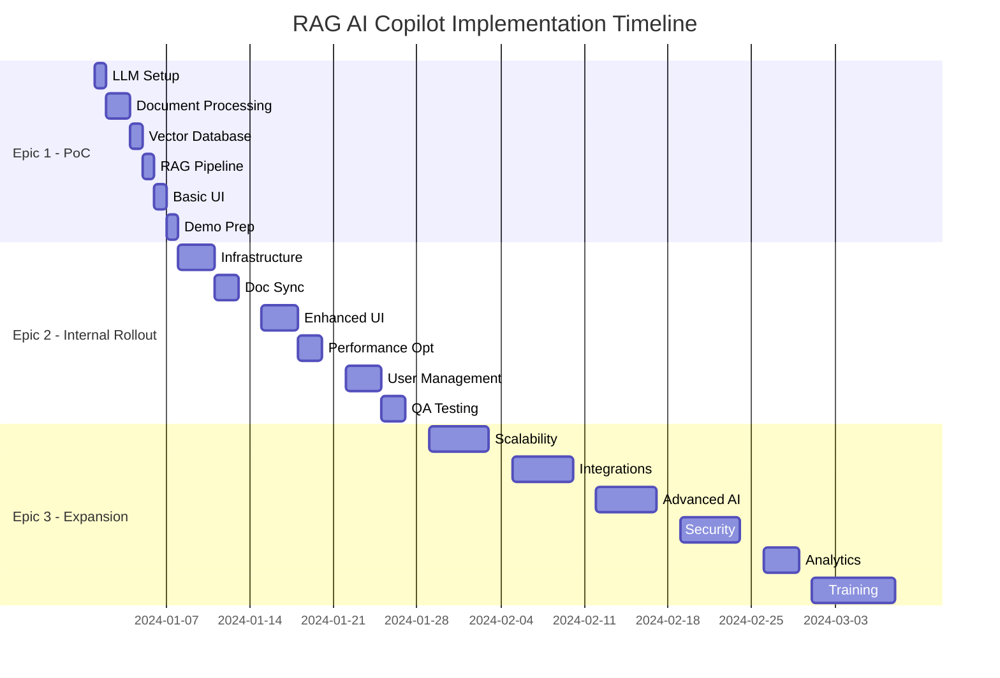

# 🚀 RAG AI Copilot - Master Project Plan

## 📋 Project Overview

**Project Name**: RAG-based AI Copilot for Internal Knowledge  
**Project Duration**: 12-16 weeks  
**Budget Estimate**: $300,000 - $500,000  
**Team Size**: 8-12 people  
**Target Users**: 200+ employees across all departments  

---

## 🎯 Project Objectives

### Primary Goals:
1. **Eliminate information silos** by creating unified knowledge access
2. **Reduce document search time** by 70% through AI-powered retrieval
3. **Ensure data security** with 100% on-premises deployment
4. **Achieve high user adoption** with 90% of target users actively using the system
5. **Demonstrate clear ROI** within 18 months of deployment

### Success Criteria:
- ✅ System handles 200+ concurrent users
- ✅ Average query response time <5 seconds
- ✅ 90% user satisfaction rating
- ✅ 25% productivity improvement in knowledge work
- ✅ Zero security incidents or data breaches

---

## 📊 Epic Summary & Timeline

| Epic | Duration | Team | Budget | Key Deliverables |
|------|----------|------|--------|------------------|
| **Epic 1: PoC** | Week 1 | 3 people | $30K | Working demo with 10 documents |
| **Epic 2: Rollout** | Weeks 2-4 | 5 people | $100K | Production system for 50 users |
| **Epic 3: Expansion** | Weeks 5-12 | 8 people | $200K | Enterprise system for 200+ users |

### Detailed Timeline:



---

## 👥 Team Structure & Responsibilities

### Core Team:

#### **Project Manager** (1 person)
- Overall project coordination and timeline management
- Stakeholder communication and reporting
- Risk management and issue resolution
- Budget tracking and resource allocation

#### **Technical Lead** (1 person)
- Technical architecture and design decisions
- Code review and quality assurance
- Technology selection and evaluation
- Integration planning and oversight

#### **Backend Developers** (2-3 people)
- RAG pipeline implementation
- Vector database optimization
- API development and microservices
- Performance tuning and scaling

#### **Frontend Developers** (1-2 people)
- User interface development
- Mobile responsiveness
- User experience optimization
- Integration with backend APIs

#### **DevOps Engineer** (1 person)
- Infrastructure setup and management
- CI/CD pipeline implementation
- Monitoring and logging systems
- Security configuration

#### **Data Engineer** (1 person)
- Document processing pipeline
- Data synchronization systems
- ETL processes for business system integration
- Data quality and governance

#### **QA Engineer** (1 person)
- Test automation and execution
- Performance testing
- Security testing
- User acceptance testing coordination

#### **Business Analyst** (1 person)
- Requirements gathering and documentation
- User story creation and refinement
- Business process analysis
- Change management support

---

## 💰 Budget Breakdown

### Epic 1: Proof of Concept ($30,000)
```
Personnel (3 people × 1 week):     $20,000
Infrastructure (development):       $3,000
Software licenses:                  $2,000
Testing and validation:             $3,000
Documentation:                      $2,000
```

### Epic 2: Internal Rollout ($100,000)
```
Personnel (5 people × 3 weeks):     $60,000
Production infrastructure:          $15,000
Software licenses (extended):       $8,000
Security tools and auditing:        $7,000
Testing and QA:                     $5,000
Training materials:                 $3,000
Contingency (2%):                   $2,000
```

### Epic 3: Expansion & Integration ($200,000)
```
Personnel (8 people × 8 weeks):     $120,000
Enterprise infrastructure:          $30,000
Business system integrations:       $20,000
Advanced AI model licenses:         $10,000
Security and compliance tools:      $8,000
Training and change management:     $7,000
Analytics and monitoring:           $3,000
Contingency (1%):                   $2,000
```

### **Total Project Budget: $330,000**

---

## 🔄 Project Phases Detail

### Phase 1: Foundation (Week 1)
**Objective**: Validate technical feasibility and business value

**Key Activities:**
- Set up development environment
- Implement core RAG functionality
- Process initial document set
- Create basic user interface
- Conduct stakeholder demo

**Deliverables:**
- Working prototype with 10 company documents
- Technical architecture documentation
- Demo presentation for leadership
- Go/no-go recommendation for next phase

**Success Criteria:**
- Demo successfully answers 80% of test questions
- Response time <15 seconds
- Stakeholder approval for next phase

---

### Phase 2: Production Deployment (Weeks 2-4)
**Objective**: Deploy stable system for internal team usage

**Key Activities:**
- Set up production infrastructure
- Implement document synchronization
- Enhance user interface and experience
- Add user management and security
- Conduct comprehensive testing

**Deliverables:**
- Production-ready system on company infrastructure
- Automated document sync from SharePoint
- Enhanced web interface with authentication
- User training materials
- Performance and security testing reports

**Success Criteria:**
- System supports 50 concurrent users
- 95% uptime during business hours
- User satisfaction >7/10

---

### Phase 3: Enterprise Scaling (Weeks 5-12)
**Objective**: Scale to enterprise level with advanced features

**Key Activities:**
- Implement microservices architecture
- Integrate with business systems
- Add advanced AI capabilities
- Ensure enterprise security compliance
- Roll out comprehensive training program

**Deliverables:**
- Scalable architecture supporting 200+ users
- Integrations with Teams, CRM, ERP systems
- Advanced analytics and reporting
- SOC 2 compliance documentation
- Company-wide training program

**Success Criteria:**
- System supports 200+ concurrent users
- 25% productivity improvement measured
- 90% user adoption achieved

---

## 📈 Risk Management Strategy

### High-Risk Items:

#### **1. Technical Complexity (Probability: High, Impact: High)**
**Mitigation:**
- Start with simple PoC to validate approach
- Use proven open-source technologies
- Plan for multiple technology options
- Regular technical reviews and course corrections

#### **2. User Adoption (Probability: Medium, Impact: High)**
**Mitigation:**
- Involve users in design process
- Comprehensive change management program
- Phased rollout with early adopters
- Continuous feedback collection and improvement

#### **3. Performance Issues (Probability: Medium, Impact: High)**
**Mitigation:**
- Load testing at each phase
- Performance monitoring from day one
- Scalable architecture from start
- Performance optimization sprints

#### **4. Security and Compliance (Probability: Low, Impact: High)**
**Mitigation:**
- Security review at each phase
- Engage security team early
- Use enterprise-grade security tools
- Regular security audits and penetration testing

---

## 📋 Quality Assurance Strategy

### Testing Approach:

#### **Unit Testing (Continuous)**
- Code coverage >90%
- Automated testing pipeline
- Test-driven development practices

#### **Integration Testing (Weekly)**
- API endpoint testing
- Database integration testing
- Third-party service integration testing

#### **Performance Testing (Each Phase)**
- Load testing with expected user volumes
- Stress testing to find breaking points
- Response time optimization

#### **Security Testing (Each Phase)**
- Vulnerability scanning
- Penetration testing
- Security code review

#### **User Acceptance Testing (Each Epic)**
- Business user validation
- Usability testing
- Accessibility compliance testing

---

## 🔗 Integration Dependencies

### Internal Systems:
- **SharePoint**: Document source and synchronization
- **Azure AD**: User authentication and authorization
- **Microsoft Teams**: Primary user interface for many users
- **Company VPN**: Secure access for remote users

### External Dependencies:
- **Ollama**: Local LLM hosting platform
- **LangChain**: RAG framework and document processing
- **Vector Database**: FAISS, Chroma, or Weaviate
- **Monitoring Tools**: Prometheus, Grafana for system monitoring

### Critical Path Dependencies:
1. **Infrastructure Approval** → Server provisioning → Development start
2. **SharePoint API Access** → Document sync implementation
3. **Security Review** → Production deployment approval
4. **User Training Completion** → Full rollout

---

## 📊 Success Metrics & KPIs

### Technical Metrics:
```yaml
performance:
  response_time: "<5 seconds (95th percentile)"
  throughput: "200+ concurrent users"
  uptime: "99.5% availability"
  error_rate: "<0.5%"

scalability:
  auto_scaling: "5-50 instances based on load"
  data_processing: "1000+ documents per hour"
  query_volume: "10,000+ queries per day"
```

### Business Metrics:
```yaml
adoption:
  user_registration: "90% of target users"
  monthly_active_users: "80% of registered users"
  queries_per_user: "10+ queries per week"

productivity:
  search_time_reduction: "70% faster than manual search"
  task_completion_rate: "25% improvement"
  user_satisfaction: ">8.5/10 rating"

roi:
  cost_savings: "$500K annually"
  payback_period: "18 months"
  roi_percentage: "300% over 3 years"
```

---

## 🔄 Change Management Plan

### Communication Strategy:

#### **Executive Level (Monthly)**
- Progress reports with key metrics
- Budget and timeline updates
- Strategic impact assessment
- Risk and mitigation updates

#### **Management Level (Bi-weekly)**
- Department-specific impact analysis
- User adoption progress
- Training schedule and progress
- Support needs assessment

#### **End User Level (Weekly)**
- Feature updates and announcements
- Training opportunities
- Success stories and best practices
- Feedback collection and response

### Training Program:

#### **Phase 1: Awareness (Weeks 1-2)**
- Project announcement and vision
- Benefits communication
- Early adopter recruitment
- Feedback channel establishment

#### **Phase 2: Preparation (Weeks 3-4)**
- Manager training and briefings
- Super-user identification and training
- Documentation and help content creation
- Support process establishment

#### **Phase 3: Rollout (Weeks 5-8)**
- User training sessions (department by department)
- Hands-on practice opportunities
- One-on-one support for struggling users
- Continuous feedback collection

#### **Phase 4: Optimization (Weeks 9-12)**
- Advanced feature training
- Best practice sharing
- Process optimization based on usage data
- Recognition and celebration of adoption wins

---

## 📋 Project Deliverables Checklist

### Epic 1 Deliverables:
- [ ] Working RAG prototype
- [ ] Technical architecture documentation
- [ ] Initial document processing pipeline
- [ ] Basic user interface
- [ ] Stakeholder demo materials
- [ ] Phase 1 completion report

### Epic 2 Deliverables:
- [ ] Production-ready system
- [ ] Automated document synchronization
- [ ] Enhanced user interface
- [ ] User management system
- [ ] Performance testing reports
- [ ] Security assessment report
- [ ] User training materials

### Epic 3 Deliverables:
- [ ] Enterprise-scale architecture
- [ ] Business system integrations
- [ ] Advanced AI capabilities
- [ ] Comprehensive analytics dashboard
- [ ] SOC 2 compliance documentation
- [ ] Complete training program
- [ ] Project closure report

---

## 🎯 Post-Implementation Plan

### Immediate (Weeks 13-16):
- **System Monitoring**: 24/7 monitoring and support
- **User Support**: Dedicated help desk for user issues
- **Performance Tuning**: Optimization based on real usage patterns
- **Feedback Integration**: Rapid iteration based on user feedback

### Short-term (Months 4-6):
- **Feature Enhancement**: Additional features based on user requests
- **Integration Expansion**: Additional business system integrations
- **Advanced Analytics**: Deeper insights and predictive capabilities
- **Security Updates**: Regular security patches and improvements

### Long-term (Year 2+):
- **AI Model Updates**: Latest model versions and improvements
- **Global Expansion**: Support for additional languages and regions
- **Advanced Features**: Voice interface, mobile apps, AR/VR integration
- **Innovation Projects**: Experimental AI capabilities and use cases

---

## 📞 Project Contacts & Escalation

### Project Team:
- **Project Manager**: \[Name\] - \[email\] - \[phone\]
- **Technical Lead**: \[Name\] - \[email\] - \[phone\]
- **Business Analyst**: \[Name\] - \[email\] - \[phone\]

### Stakeholders:
- **Executive Sponsor**: \[Name\] - \[email\] - \[phone\]
- **IT Director**: \[Name\] - \[email\] - \[phone\]
- **Security Officer**: \[Name\] - \[email\] - \[phone\]

### Escalation Path:
1. **Level 1**: Project team members
2. **Level 2**: Project Manager
3. **Level 3**: Technical Lead + Business Analyst
4. **Level 4**: Executive Sponsor

---

**Document Version**: 1.0  
**Last Updated**: \[Current Date\]  
**Next Review**: Weekly during execution  
**Approval Status**: Pending stakeholder review 